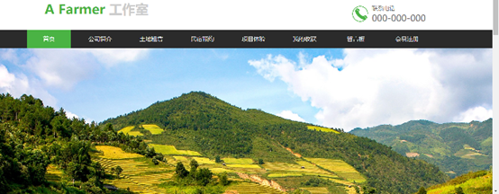
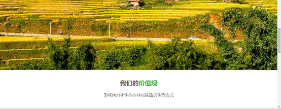
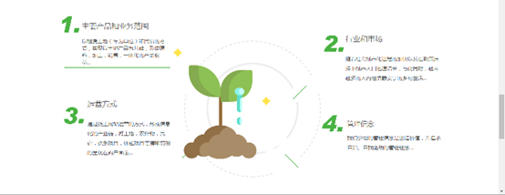
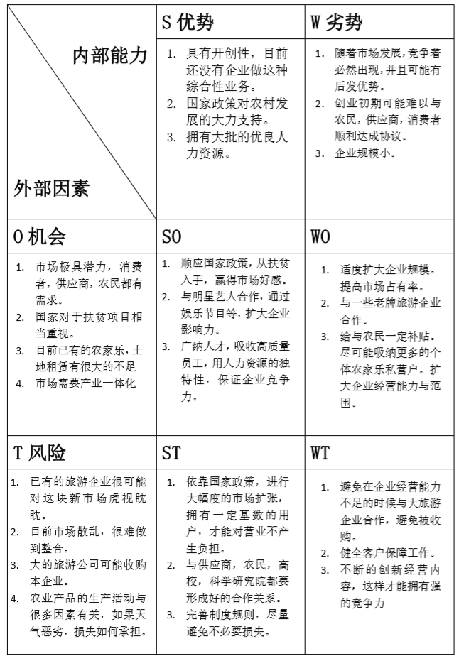
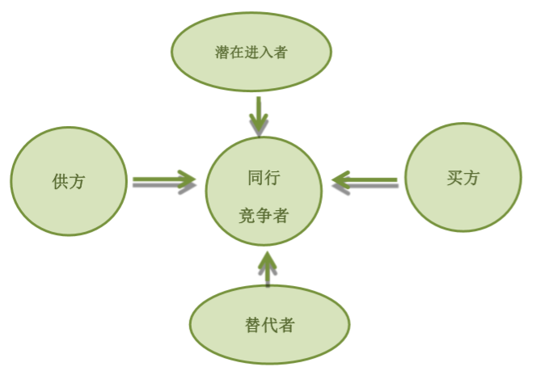
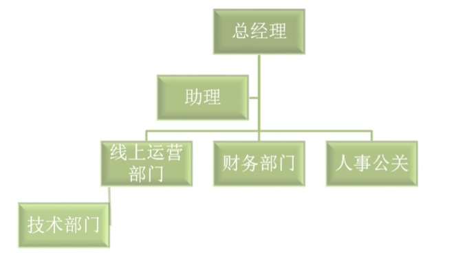

项目名称:”a farmer”工作室 
负责人：魏征 
电话：15352407446 
指导老师：郭卫东 
团队成员：高雪燕、高文彬、陈昕怡、关舒馨 
参赛赛区：北京赛区 
参赛学校：首都经济贸易大学 
参赛类别:三农电子商务 

#### 摘要 ：

​		我们的项目名称叫做**“a farmer”工作室**，主要产品和业务范围是以租赁土地（年为单位）和民宿的方式，实现以土地产品为基础，形成原料，加工，销售，一体化的产品收益，以及乡村体验式生活，乡村旅游，乡村娱乐，农产品研究与种植一体化的服务范围，让城市人群更好的体验不同的乡村生活。 行业和市场方面，随着社会城市化进程的加快以及在政策扶持下城市人口迅速增长，与此同时，越来越多的人向往恬静安宁的乡村生活，我国的农家乐行业也成为未来我国生态旅行发展的主要趋势之一，我们的项目就此以产品为基础，将城乡旅游就娱乐，种植，生活，学习，销售结合起来，与此同时，该领域市场处于婴儿期，并未形成信息化的产业链。行业发展前景广阔，市场规模大，具有潜力。 在营销策略与运营方式方面通过线上网站运营的方式，形成信息化的产业链，将土地，农作物，民宿，娱乐项目，体验项目等清晰简明的呈现在客户面前。 生产管理计划及管理者方面，我们的团队以大力发展农村经济为出发点，详细计划计划准备包括编写商业项目计划书，制作项目策划案，app 试研发，审核过后即进入项目前期运营阶段等。团队成员分配合理，各尽其职，一同合作完成。 预期收益与企业战略目标方面,客户按年所支付的土地租赁费用为主要收益来源之一，其他收益来源主要依靠民宿，农产品售卖，项目体验，以及后期平台用户规模增长，广告商也是部分收入来源。企业战略目标则在工作室稳定运营后逐渐在全国推广，形成信息化生态农业渗透式生活方式。 

## “a farmer”工作室 项目策划书 

### 项目概况

​		在社会飞速发展的时代背景下，越来越多的城市人口离农村越来越远。塑料大棚的出现市使农作物可以违背自然规律出现在我们的餐桌上；高科技的发展改变了植物的结构，出现了转基因食品；而新时代的青少年更是对养育我们的土地知之甚少。“a farmer”工作室想为城市和乡村之间构建一座桥梁，收集整合郊区、农村等地的土地，建立实验基地，利用互联网，以租赁土地（年为单位）和民宿的方式，让城市人群更好地体验乡村生活。实现以土地产品为基础，形成原料，加工，销售一体化的产品收益，以及乡村娱乐，乡村旅游，农产品研究与种植多为一体的产业链。从而使部分土地资源的价值最大化，带动农村、郊区等地的就业以及基础设施建设，拉动这些地区的旅游业发展，并且我们旨在传播农业方面的知识，找回一些逐渐被人们所忽略的农村文化，使城市人与农村的联系更加紧密。 

### 项目简述 

公司名称：a farmer 工作室 
项目性质：以线上线下结合的方式，体验乡村娱乐、旅游，协助农民进行种植分析和商品出售，试验田研究。 
项目简介:通过 app 实现乡村娱乐旅游，如土地租赁，民俗预约，垂钓预约，采摘预约，烧烤野餐等活动安排选择；土地生产帮助，如：农产品市场分析，最优经济作物批量种植分析，供应商—加工商交易平台等；试验田研究：包括新农作物研究，高校大学生参观预约，提供农民种植培训服务等，三项功能。 通过微信公众号进行乡村旅游活动推荐，种植经验交流，租地种植者经验交流等。通过网页实现所有包括交易，社交论坛，广告宣传等多重功能。 
微信平台：a farmer 工作室 
项目进度：目前已经完成初步的网页开发，app 未完成开发，公众号已开发但尚未实现初步运营。 








## 项目背景 

**（一）、在党的十九大会议中，关于农业方面，要求全面贯彻党的十九大精神，以习近平新时代中国特色社会主义思想为指导。** 

1. 坚持新发展理念，牢固树立和践行绿水青山就是金山银山理念，以深入推进农业供给侧结构性改革为主线，。以资源环境承载力为基准，实施乡村振兴战略。 
2. 坚持以粮食安全、绿色供给、农民增收为基本任务。提高绿色农产品有效供给,变绿色为效益，促进农民增收，助力脱贫攻坚。 
3. 坚持以制度创新、政策创新、科技创新为基本动力。全面深化改革，加快创设有利于推动农业绿色发展的体制机制和政策措施，健全保障农业绿色发展的考核评价体系，形成支撑全区绿色农业发展的制度体系。开展农产品绿色生产、加工、运输、存储全产业链科技联合攻关，积极推进绿色储粮，推进产学研一体化，加快推动绿色生态农业技术集成示范与推广，培育以绿色科技为引领的农业发展新动能，全面激活农业绿色发展的内生动力。  
4. 推动农村人才建设。没有人乡村振兴就是一句空话，加大三农干部的培养力度，全面建立职业农民的制度。加快培育新型的农业经济主体，发展农业的适度经营支持各类人才返乡、下乡创业兴业，包括城里的人才，鼓励各类人才在农村在广阔天地大显身手。 国家鼓励创新，发展农村，这些都为我们提供了政策支持。 

项目背景 
**(二）、“现在全世界都面临着乡村劳动力短缺问题，加上现代工业和城市化的影响，世界上许多重要的独特的农业文化遗产在不断萎缩。”**

联合国粮食及农业组织总干事若泽·格拉齐亚诺·达席尔瓦表示，“农民是农业文化遗产的所有者和最主要的保护者，只有让他们从中受益，才能让保护和传承工作一直持续。我们要找到保护、发展、传承和农民收益的平衡点，并以经济科学的方式把遗产地的潜在价值转化为现实生产力。” 青少年对农村的了解越来越少，某些文化正在一点点地流失（缺乏农作物的基本概念，不知道粮食或蔬菜的种类，播种收获季节等，与大自然的亲密接触变少，文学作品里乡村孩子的童年离城市越来越远） 
 **（三）、推进农业供给侧结构性改革是中央经济工作会议明确的今年重点工作之一。今年以来，我国农业供给侧结构性改革实现了“两稳三进”。**

“两稳”，就是农业生产稳、农民收入稳。“三进”，就是农业结构调整有序推进，农业绿色发展大步迈进，农村改革稳步前进。总体看，上半年农业农村经济实现良好开局，为经济社会发展大局提供了重要支撑，发挥了“压舱石”的作用。 农业供给侧结构性改革不是简单地在生产水平上作“量”的增减，而是从产业和体制两个方面增强供给体系对需求变化的适应性和灵活性，提高农业全要素生产率。因此，要优化产品结构，提供更优质安全的农产品，满足多层次、个性化需求；要优化产业结构，促进农业功能拓展，使生产向优势区聚集；要优化经营结构，培育新型经营主体，发展适度规模经营。 
 **（四）、与此同时，由于环境污染日益严重，人们的观念逐步发生变化，绿色无污染食品已成为迫切需求，优质农产品是人们物质生活不可缺少的一部分。**


## A farmer 官网 内容介绍

“a farmer”APP主要分为5个板块，用户通过不同的界面获得自己所需要的信息。

#### Part1 土地生产帮助模块

​		第一个界面是一个坐标式的中国地图。用户可通过点击坐标了解不同季节不同区域的土地在种什么农产品，以及该农产品的信息，例如实时图片，熟制，播种与收获时间，亩产量等。

​		该地图主要突出各地特色有代表性的农产品。以及每个地方有政府主导性推出的部分农产品。以甘肃举例，以定西为中心形成的马铃薯生产基地，以陇西、岷县、渭源为中心的中药材生产，以庆阳、平凉、天水为中心的苹果生产，以河西走廊、泾河渭河流域为中心的喜温喜凉蔬菜的生产。以及瓜州蜜瓜，武都花椒，兰州苦水玫瑰等等。既有政策支持，又有特色推荐的产品。

 	除各地区适宜的农产品种植推荐，农产品市场价格分析等，本模块还涉及B2B的交易，帮助加工商寻找农产品供应商合作伙伴，防止农产品堆积导致的大量浪费。

#### Part 2乡村娱乐旅游模块 

本模块主营业务有

1. 土地租赁（亩），为想体验种植的客户服务，按年租赁，消费者可以按时令体验播种，除草除虫，采摘，甚至嫁接等各种农业体验。客户可输入目的地关键词，便会弹出该地周围的田地情况。页面显示该田地的相关信息：有多少块，每块的面积及价格、该年的预定情况、适宜种植的作物等。顾客可通过咨询客服了解相关信息，通过线上支付的方式预定土地。被顾客预定的土地及作物平时有专人照料每块租赁地会配备一为农民协助看管，一位农业专业的实习生提供农业知识指导，这样不仅成年人可以体验农业活动的乐趣，孩子也可以在家长的带领下，学习更多的知识，开阔眼界，充实经历，快乐学习，快乐劳动，培养孩子的责任心。

2. 民宿预订，为周末，节假日来乡村旅行的消费者提供住宿预约。

3. 活动预约，包括乡村烧烤，野餐活动的预约，采摘体验预约，游戏预约（蹦极，漂流等）

4. 农产品购买及送货上门

#### Part 3试验田研究

​	这个版块主要是与科学研究院及高校合作，为农作物实验室研究提供实操场地，为培养创新型农业人才专门设立。试验田提供参观体验，同时为农民种植提供技术指导。

#### Part 4 用户中心

​		这一部分是用户个人信息中心，俗称“我的”，用户可设置个人资料，查询自己的土地与民宿预定情况，自己的土地作物生长状况等。

​		它和微信、支付宝等具有支付功能的软件相关联，可以记录用户的一切历史交易，还可以进行银行卡的绑定。用户可以用微信、QQ、微博的账号来进行用户名的登录，也可以通过身份证号码、手机验证码进行登录。还具有收藏功能，来收藏一些对自己有用的关于农耕的知识。还具有设置功能。也可以发布动态，或者通过广场查看他人动态。

​		交流板块。是一个具有交流和分享功能的板块。用户可以将在使用此app时所遇到的问题和感想分享给其他用户，还可以和有相同观念的人交流土地耕作时的技巧。

​		该模块与a farmer 公众号相连接，公众号内包括乡村旅游推荐，农业知识普及，农民种植经验分享，租地用户体验分享，农业和社交方面的法律知识等。有关农业方面的信息分类，起一个知识普及的作用，我们会科普相关资料，例如动植物生长习性、生长时间、地区、种类等，同时附带图片信息。条件允许的还有视频短片。

####  Part 5 客服中心

用于用户反馈，处理用户的疑难问题，包括支付问题，租赁问题，预约问题等等。

**注：app内容与官网一致，方便移动端 用户使用。**


## A farmer 线上平台开发意义 

1. 整合闲散土地资源（尤其郊区），部分土地商业价值最大化

2. 开发郊区、和农村的旅游资源

3. 科普农业知识

4. .文化含义

5. 为人们的休闲娱乐提供新方式

6. 带动部分就业

7. 响应政策号召

8. 为大学生提供更多的创业可能

####  市场分析

##### 行业背景及市场规模

随着社会的城市化发展，越来越多的城市人口向往田园的体验生活，2018年我国农家乐接待人数就突破了6亿人次，到2019年接待人数实现翻番，达到12亿人次，农家乐数量达到150万家，销售收入达到3200亿元，带动农村受益人群达3300万人，是我国未来生态旅游发展的主要趋势之一，预计到2020年我国农家乐行业市场规模将突破9000亿元，行业发展前景非常光明。同时城郊租地市场发展良好，乡村游占比增加，因此，a farmer 项目立志于把城乡租地产业化，将娱乐，种植，旅游结合起来，以产品为基础，市场规模相当大，市场颇具潜力。随着运作模式的成熟，会带动乡村旅游业的发展，我们也可以在平台上加**入天然的各地区特色农产品销售部分。**

1. 近年来中国为提高国人受教育程度，大学生的升学比列逐年升高；并且大学生是社会的主要力量，能够快速接受并学习新的知识，对于大学生使用互联网占整个社会人口的一半，中国大学生也是一部分市场。大学生对于很多食材都不是很了解，在枯燥的生活中他们会享受自己种植一种蔬菜或 植物的喜悦，他们会把种植看成一种兴趣爱好，去填充平凡的大学生活。

2. 对于现代生活在大城市的白领，他们每天面对自己重复的工作会感到疲劳，他们希望自己的生活充满色彩，希望自己的生活除了工作还有一些其他能释放工作生活压力的事情，种植绿色植物或种植蔬菜的过程对于白领来说是一种尝试新鲜事物的方式，大家都喜欢尝试新鲜事物去充实自己枯燥的生活。

3. 现如今学校的教育不在局限于理论知识的传授，学校会组织一些户外时间活动开拓学生的知识面，并在实践活动中提高学生的实践能力。可以与高校合作，在保证学生安全的情况下有序的组织学生完成实践活动。也可以**与相关的户外拓展组织合作。**

4. 随着社会的快速发展，很多父母注重自己孩子的教育与心理发展，会利用节假日带自己的孩子去室外活动，促进家庭的和谐与发展，提高孩子的实践能力以及思维创新能力。对于父母而言，带着自己的孩子去种植绿色植物，认识植物是一个很好的选择。

5. 相关的企业单位，出游聚餐的良好选择

6. 随着人民生活水平的日益提高，节假日出游成为人们的一种放松方式，但是节假日各种景点出现“人山人海”的现象也较为普遍，我们尝试为节假日出游提供一种新的方式，比如包括种植、采摘农产品，体验当地人文习俗等的乡村旅游，也是一部分市场。

#### 行业问题

​		近几年，由于城市人口有娱乐乡村的意向，有体验种植的爱好，城郊人口有提高经济收入的需求，随着城乡直接的联系密切，已出现了普遍的城郊农民租地的经济行为。城乡租地的市场前景非常好，但与此同时，这个市场处于婴儿期，目前还没能行形成规模。当前的市场还是以单独的租地和农家乐为主，未能形成产业链。

##### 当前城郊租地市场特征

1. 租地行为的非市场性

```
非市场性是指一种活动所产生的成本或利益未能通过市场价格反映出来而是无意识强加于他人租地行为的非市场性是指土地租赁这种经济行为还没有市场化仅仅只是出租者与承租者內部的,私人的一种交易租地经营行为同时还具有自发分散自愿性
```
2. 租地行为的非正规性

```
租地仅仅是出租者与承租者的一种私人交易使得租赁的程序不规范租赁手续不齐全,大多数农户选择口头约定的契约形式这主要是因农户缺乏市场意识而且签订正式的租赁合同需要花费较大的交易成本,得不偿失租地行为的低地租性也是非规范性的一种表现.
```

3. 租地经营的家庭性

```
20世纪80年代初确定的家庭承包责任制是在农民自发实践的基础上由国家自上而下推行的一项农地制度家庭承包责任制使得农地使用上呈现一种单一生,家庭作业性以及小规模性农户分到的土地是有限的,因此土地租赁规模并不大,并且进行经营的一般以家庭为单位,属于小型的家庭作坊模式.
```

4. 租地经营的非专用性

```
一般来讲承租者租人土地就是为了扩大农作物种植规模,形成一种相对而言的规模种植,但是这种规模种植只是相对的规模种植的市场依赖性很强即市场需要什么则种植什么,虽然在规模种植中首次投入成本较高,但据调查了解承租者一般在3-5年内会转产,即形成租赁的非专业性。
```

#### 农家乐以及民宿市场特征

1. 非专业性 

```
农家乐设施欠缺，服务水平不足。不论是农家乐还是民宿，由于其专业性欠佳，对消费者的吸引力不足，即便消费者有体验乡村生活，乡村娱乐的需求，但乡村游的现实体验差，最终似的乡村游的市场发展畸形。
```

2. 地区差异性

```
以九寨沟为例，自然资源审美价值极高，其周边的农家乐市场较好，岭南的民俗村具有丰富的民俗文化，也拥有强的市场竞争力，但其实大部分的农家乐，并不具有先天的优势，后天的娱乐设施又不足，严重导致农家乐的地区差异极大。从本质上来说，农家乐并没有解决城郊农民的生活问题。
```

#### 农产品产供销特征

1. 农产品生长的必要条件。

```
农产品在生长过程中对大自然的条件有必要的要求。如遇自然灾害，农产品的产量会收到极大的影响，人为无法控制。
农产品不易保存，易腐蚀。如在运输过程或销售过程中出现问题，农产品的堆积会造成极大的损失。

```

2. 种植农产品所需的科研技术团队。

```
农产品种植为了提高其产量，需要建立自己的培育研究团队，避免不要的损失，利用科学研究将利益最大化。
```

3. 不同区域的供应与需求量。

```
在不同的城市，市民需求的农产品品种不同，不同的区域可种植的农产品不同，导致供应与需求不同衡。
```

4. 农产品生长周期问题。

```
有的农产品需要培育几年后才会结果实，无法预测农产品的产量以及质量。无法衡量一些潜在风险。
```

#### PEST分析(宏观环境分析)

##### 政治环境

​	近年来,党和政府高度重规土地问题,把土地资源定位为参不宏观调控的主要手段,国务院《关于深化改革严格土地管理的决定》下发后,特别是《国务院关于加强土地调控有关问题的通知》进一步明确土地管理和耕地保护的责仸文件精神,明确各级政府是土地管理和耕地保护的第一责仸人.各级地方政府和国土资源管理部门加大了对《土地管理法》的宣传和实施力度,执法部门也加大了对远法用地的查处力度,对农村土地管理尤其是耕地保护作出了巨大努力。在农村中,远法用地,乱占、滥用耕地建房的现象虽然得到了有效遏制,农民建房也正在走上依法管理的道路

​	为适应新形势下农村土地利用和管理的现实需要，2019年2月3日，国土资源部印发《关于有序开展村土地利用规划编制工作的指导意见》，明确鼓励有条件的地区编制村土地利用规划，统筹安排各项土地利用活动，加强农村土地利用供给的精细化管理，为农村地区同步实现全面建成小康社会目标做好服务和保障。《意见》指出，当前我国农村土地利用和管理面临建设布局散乱、用地粗放低效、公共设施缺乏、乡村风貌退化等问题，同时正在开展的农村土地征收、集体经营性建设用地入市、宅基地制度改革试点，推进农村一、二、三产业融合发展以及社会主义新农村建设等工作，都迫切需要编制村土地利用规划，通过细化乡（镇）土地利用总体规划安排，统筹各项土地利用活动，适应新时期农业农村发展要求。《意见》明确，开展农村土地制度改革试点、社会主义新农村建设、新型农村社区建设、土地整治和特色景观旅游名镇名村保护的地方，应当编制村土地利用规划；其他地方要明确推进时间表，结合实际有序开展。村土地利用规划是乡（镇）土地利用总体规划的重要组成部分，是乡（镇）土地利用总体规划在村域内的进一步细化和落实。村土地利用规划编制工作，由县级人民政府统一部署，县级国土资源管理部门会同有关部门统筹协调，乡（镇）人民政府具体组织编制，引导村民委员会全程参与。《意见》强调，要坚持村民主体地位，切实保障村民的知情权、参与权、表达权和监督权，让村民真正参与到规划编制各个环节，使村土地利用规划成为实现村民意愿的载体和平台。《意见》强调，严格村土地利用规划实施管理。村土地利用规划一经公告，应当作为土地利用的村规民约严格执行。村庄建设、基础设施建设和各项土地利用活动，必须按照村土地利用规划确定的用途使用土地，不得随意突破或修改。确因特殊情况需要修改规划的，应制定规划修改方案，按法定程序报规划原审批机关同意，确保规划的严肃性。

##### 经济环境

​		随着农村经济的发展,农民生活观念的逐渐变化,特别是在中央惠农政策的大环境下,农村农民住宅建设空前活跃,由于各地的地理位置、自然条件不尽相同,导致目前农民建房还存在着不少的问题,破坏、闲置浪费耕地现象随之大量出现。其原因归于以下:

1. 缺乏耕地保护考评机制。

```
在农村土地开发利用中,尽管大多数村级组织已成立了与门的管理机构,安排工作人员与门负责农村土地的开发利用管理,提供土地方面法律咨询,但却未建立工作人员的考核机制,特别是作为地方政府重要管理职责的耕地保护工作没有纳入干部年终考核内容,形成管理上的缺位。
```

2. 没有建立和健全用地预审制度。

```
所谓用地预审就是审查该项目是否符合土地利用总体觃划,是否符合国家产丒政策,是否符合国家双控指标等用地条件。过去一段时期,虽然建立了用地预审制度,但未能根据村里实际情况,对相关机制作进一步完善,并不城建、觃划、环保等部门进行很好配合协作,使工厂、村办企丒私自不农村集体经济组织签订征地协议,擅自征地、用地行为多次发生,这不仅严重远反了土地利用总体觃划造成村里土地大面积抛荒,损害了农民的利益,也使农民集体上访事件急增,影响了农村社会的稳定。
```

3. 农村土地执法难度依然存在。

```
农村土地执法难度依然存在,表现在“三难”:一是调查难。主要在开展案件调查工作时,有些村民不配合、不理睬,甚至设置障碍使调查工作难以开展;二是制止难。在制止远法村民用地行为时往往会遇到较大阻力;三是执行难。对非法占地行为实施没收戒拆除远法建筑的行政处罚时,尽管甲请了法院强制执行,并交了执行费,但真正执行到位的很少,降低了执法效果。
```

4. 缺乏统一的地面物补偿标准。

```
由于相当长一段时期内,农村进行了大觃模的产丒结构调整,相当多的农民在集体土地上搭建临时管理用房,加上临时用房赔偿标准不一,给征地工作中的地上物补偿工作带来了严重的阻力。
```

5. 项目建设占用基本农田情况依然存在。

```
随着新农村建设项目的投入,建设占用耕地已经达到一定的数量,经常出现了只要发生用地就会涉及基本农田的现象。与此同时，非农建设用地征而不用，导致土地闲置，以及人为开采矿产资源、烧制砖瓦；建筑取土等生产和建设活动导致土地废弃，也是土地大量闲置撂荒的原因之一。
```

##### 社会环境

​		农村土地资源市场化是市场经济条件下的必然选择，也是解决目前我国农村土地利用中所存在矛盾的有效途径。

​		中国农村人口占总人口的75％左右，而农村居民点用地一度占全国城乡居民点用地总面积的87％。近年来，随着农民收入水平的提高，广大农村出现了一股“建房热”，村庄建设面积迅速增加，超过了国家规划用地的控制目标。与此同时，农村还出现了大量的“空心村”。随着农民生活水平的提高，对比较拥挤的住房条件不够满意等原因，许多农户选择新的宅基地建房，同时又占据着原来的老宅基地，导致村内少人或无人居住。“空心村”现象在我国广大农村普遍存在，使耕地占用浪费严重。

​		沿海地区、大中城市郊区、国内经济发达地区，随着乡镇企业和农村第二、第三产业的迅速发展，加之工农业利润差居高不下，逐步拉大了农业与其他行业之间的收入差距。在农业内部，农业生产资料价格攀升，与粮食等主要农产品价格下降形成强烈反差，而且农产品销售不畅、卖粮难，导致农业效益比较低，挫伤农民种田积极性，以上是农民弃耕撂荒的主要原因。

　	新的形势下，我国农村土地改革的根本出路还是在于逐步实现农村土地的市场化，逐步建立起与社会主义市场经济相适应的、有利于土地资源充分开发与合理利用的市场机制，实现土地资源配置合理化和资产效益最大化，以促进农村市场经济和农业现代化的发展。将农村土地推向市场，实行农村土地资源市场化是我国农村土地制度变革的重大举措，它必将对我国农业和农村经济发展产生巨大的作用和影响，有利于农业规模化、专业化、集约化的发展，有利于农村土地的合理开发利用、农业剩余劳动力的转移和农村产业结构的优化。

##### 技术环境

​		为了加强农村基层建设，不断提高农村的管理水平，党和政府做出了为广大农村配备大学生村官的重大决策。2008年，中央组织部等有关部门决定，用5年时间选聘10万名高校毕业生到农村任职。中共中央政治局委员、中央书记处书记、中组部部长李源潮同志指出，要切实做好选聘高校毕业生到村任职工作，这既是为社会主义新农村建设培养骨干力量，更是新时期培养新一代德才兼备干部的重要途径，也是党和政府在十七大后所做出的最具战略意义的重大决策。实践证明，实施大学生“村官”工作计划对打破农村人才匮乏局面，改善农村干部队伍的人才结构，提高农村干部的整体素质，促进科技成果转化和推广，促进农村公共管理水平提高和城乡人才双向流动，拓宽培养选拔干部途径，推进新农村与和谐社会建设具有重要意义和积极作用。

​		基于村土地利用规划技术路线，优化规划编制的外部经济环境也至关重要。一是以深化农村土地制度改革增强农村活力，发展股份制、家庭农场等规模农业、特色农业经济形式，节约集约土地，为三产融合、产业兴旺奠定基础；二是建设城乡融合互利共赢的体制机制，推动城乡资源有序流动，资源流动中优化土地利用空间布局，提供空间发展的承载力；三是全域综合整治治理活动仅仅是单一的实施抓手，难以撬动整个农村经济活力，只有在发展战略目标确定的条件下，才是有效的实施措施。在无法达到整个系统持续运转的情况下，规范现有乡村经济的发展也是村土地利用规划的一条技术路径。

#### SWOT分析（企业综合能力）



#### 波特五力分析（行业竞争分析） 



##### 供应商的议价能力 

​		供应商的议价能力是说现有企业向供应商购买原料时，供应商争取获得较好价格的能力。对于本公司来说，其“供应商”就是大批的农家乐个体户和农村有空闲地的人员，以及农产品供应商，广告投资赞助商等。我公司以农村经济发展为根本，在国家帮扶政策上占有优势，但是前期在议价能力上我们没有绝对的优势，前期运营成本较高，后期会有所好转。虽然“供应商”体量庞大，数目众多，但只要能在初期吸收大批的农民和加工商合作，后期的市场规模扩大就不成问题。前期可能有优惠政策等，但总的来说投入不会过大，难点在于如何说服农村个体经营散户加入我们。

##### 购买者的议价能力 

​		购买者议价能力简单的说就是借助“货比三家”要求“物美价廉”的能力，通过从卖方和竞争者彼此对立的状态中获利。由于这个市场现在正处于婴儿期，拥有无限的潜力，“购买者”包括乡村体验消费者，农民，加工商等的需求都未被满足，所以在购买者议价能力上我们占有绝对优势。 

##### 替代竞争者的威胁 

​		由于乡村经济没有形成生产，加工，娱乐消费与服务一体化的产业，一旦我们公司开始对这个市场进行一体化，就必然会吸引到老牌的，实力雄厚的旅游企业的注意。这些大的旅游企业，依靠其自身的雄厚实力和后发优势，很有可能对我们公司进行迅速的吞并。替代竞争者威胁极大，因此，我们应该注意在初期就迅速占有市场，后期则以项目创新为主，保持独有的竞争优势。 

##### 潜在竞争者的威胁 

​		潜在竞争者的进入取决于市场进入壁垒和生存环境。目前看来，现有的行业不存在潜在竞争者，个体散户的农家乐经营也不会对我们构成威胁。因此不存在潜在竞争者威胁。 

##### 行业内同类竞争者的威胁 

​		这样一体化的企业目前还在市场上不存在，我们公司一旦开始，就必然会吸引很多人进入这个市场。新进入市场的同行，同样也享受国家政策的帮扶，而且他们具有后发优势，对我们的经营可能会有很大的冲击，应努力依靠提高企业自身的竞争力来立足于市场的不败之地，如：通过与娱乐节目合作，提高曝光率，招聘优秀员工，好的人力资源管理也是企业的独有竞争优势，并且具有其他企业难以效仿的特性。注意避免价格战等一系列恶意竞争。

### 运营方式 

“a farmer”通过线上运营的方式将土地、民宿的租赁信息发布在页面上，客户在浏览后可以选择自己想要预定的相关内容，通过微信支付宝银行卡等支付方式完成订单。 

每块租赁的土地根据都是以年为单位，根据所处位置的不同、面积的大小，价格也不同。除此之外，考虑不同顾客的不同需求，在不同时间季节，我们还提供用户种植体验、采摘体验、乡村娱乐项目体验等项目。 

我们所建立的实验基地选址会考虑交通、离城市的距离等多方因素，并做好宣传工作，以便争取更多的客户资源。 

在周围民宿等基础设施的建设以及团队管理方面，我们也会制定合理的规划与培训，使顾客获得更好的服务体验。

### 成本分析及利润空间 

#### 成本分析 

​		成本是拟定产品价格的重要依据，是为了达到某一种特定目的而耗或放弃的资源，生产活动中所使用的生产要素的价格。控制成本是提高资金效益的重要手段，产品成本的高低直接影响企业的资金效益。企业投入等量资金，合理的成本的企业生产合理价格的产品，有利于扩大销售收入，提高资金效益和市场竞争，为在市场经济中的盈利打下坚实基础。 

​		我公司产品的成本主要来源于信息采集成本，土地成本，人力成本，基础设施建设成本，线上平台运营成本这五个方面。 

#### 一、信息采集成本 

​		一进入线上平台首个界面就需要一副带有农作物标记的中国地图，以及各地特色有代表性的农产品大数据详细资料统计。需要在卫星地图上的大量投入，以及各地农业部门的精确数据，将各种需求集中起来，为必要成本输出。 
​		但要注意不定的量值变化，例如，某地的创新型蔬果的出现，或不具特色产量下降的产品及时更新地图数据，对成本升降有一定影响。 

#### 二、土地成本 

​		我们的线上平台要给现代的城市人更直观清晰的农村体验与新的出行选择，就需要从全国各地租赁或购买大量的试验田。较大数量的土地需求可能获得应对应的折扣价格或政府支持，以此使我们的体验产品也有一个较优惠的价格。 
​		同时需要了解更多的市场信息，土地价格高则体验价格高，土地价格低则体验价格低。土地价格的升降是影响成本的主要因素。选择利益最大品质最优的土地可以让用户拥有优秀的体验实践获得最大的收益。 

#### 三、人力成本

​		作为一个关于“farmer”线上平台，人员必须包括:产品经理，程序开发人员，测试专员，运营团队，UI 设计等。注重人员的合理配置，建立合理的组织机构。坚持合理的引进和使用人才，充分发挥个人潜能。

​		进行人力资源成本的效益性分析，目的是有效的利用人力资源，保证每条程序的合理运行与严格执行。 

#### 四、基础设施建设成本

​		大部分试验田附近都有我们设置的民宿，供旅客在在体验农家生活的同时休闲娱乐，成为真正的“农民”。这些民宿大部分是我们寻找的合作伙伴，既承担日常的民宿职能又为我们提供民宿体验。我们只需要与他们达成协议进行分成即可。这样我们的投入成本将会大大降低。其他的基础设施即为试验田所需的各种设施，要严格控制各种设施的合理使用，杜绝浪费，加强监督。 

#### 五、线上平台运营成本 

​		平台的运营需求越多越仔细开发成本越高。以 app 为例，一个简单的 APP，通常就需要五大产品，即安卓版 APP、苹果 iOS 版 APP、电脑端的运营管理后台、手机端的运营管理助手，还有就是服务器的部署。背后都需要庞大的系统做支持，而且功能的细分非常多。一个简单的 APP，就涉及登录注册、商品发布、信息发布、个人中心、在线沟通、积分系统、下单支付、收藏评论、转发分享、会员管理等几大板块。每一个板块后，又有很多小的功能细节，最简单的，注册功能，也包含手册注册、邮箱注册、验证码等。APP 后期运营也从需要专业人员进行维护，因此专业人员的需求非常重要。app 运行新颖有创意更加吸引客户也更能提高资金效益。 

#### 利润空间 

​		我们会联系相关区域的政府部门，大规模收集闲散土地，争取以最优惠的价格购买或长时间租赁土地，而客户所支付的租赁费用是我们主要的利润来源之一。 
​		除此之外，还有供应商应缴会员费，乡村娱乐旅游活动费用抽成。 除去平台的点击下载量，在平台用户规模增长后，广告商也是一部分收入来源。 

(一般来说:土地价格普遍在500-2000之间，相对偏远的地方每亩在500-800元一年，地理位置好的地方在每亩在1000-2000元每年;农村的地如果靠近城市或国道征收了，一亩可值三到四万不等;租用的话，土地没有附着物没有农作物的话，500-1500元一亩一年;林地价格从50-2000元左右都有，主要看土地位置）

### 战略定位及风险评估 

#### 战略定位 

1. 核心竞争力分析：目前行业对手较少，本项目的竞争力较强，若形成完善的运作模式，市场潜力较大。

2. 外部环境分析：在第一章项目背景中我们提到，不论是社会现状，还是政策等方面，我们都占据着一定的优势。

3. 战略规划:我们在研发APP的同时要做好数据采集和整理，在获得小规模土地租赁使用权后试运行，在试运行中发现不足，完善运营模式。

#### 风险评估

1. 经营风险：人力资源短缺，前期技术积累不足，技术人才短缺、部门协调与管理风险；应收账款风险，账期内不能有效的回收账款；存货风险，农产品的堆积与存货，引起资金断裂

2. 交易风险：签约客户自身是否有履行能力，是否会出现无法交易或交易的成本超出预算导致的亏损；合同履行的风险，在违约的处理，纠纷处理，终止合约等带来的额外责任与成本。
3. 市场风险：产品认可度低，客户证明交付能力和产品性能的作用，引起市场扩张和布局，市场布局层面的均衡长短的风险；同类产品的竞争：同类产品引发价格战，使回收成本周期加长；

4. 产品维护风险：维护客户关注度及持续经营能力，信誉风险、用户体验差等

5. 技术风险：研发问题：产品研发经费超支、技术瓶颈、数据采集和处理困难等，后期运营问题：后期技术的支持，产品实时数据的收集处理

6. 自然因素风险:农产品的特点之一就是依赖自然条件，不同地区的不同自然灾害对农产品的生长有着极大的影响，如过遇到自然灾害，尤其是对以一年为一个周期的农产品来说是无法挽救的。

7. 产业波动风险:整个农产品产业波动与整个市场环境，需求变动，资本成本，政府干预，法律法规的影响，致使农产品在不同的阶段不同年份，价格不稳定，无法确定我们的投资与回报成正比。

### 团队管理与组织

团队组织与管理

##### 综述:

​		随着近期我国不断走向转型化进程以及社会就业压力的不断加剧，创业逐渐成为在校大学生和毕业大学生的一种职业选择方式。大学生作为我国的年轻高级知识人群，有着较为丰富的知识储备和相较于其他高级知识份子所欠缺的创造力，是符合在我国十三五规划的创业主要人群。
​		本团队以大力发展农村经济为出发点，设计研发并经营“a farmer”手机端第三方应用程序。该app 的普及可以带动乡村经济，解决一部分人口的就业问题（尤其集中于由于种种因素未能就业的大学生），加速城乡建设同时保护环境。
​		“a farmer”app页面美观，操作简单。主要功能包括采摘体验预定，种植体验预定，乡村度假预定（与农家乐个体合作），农副产品种类及亩产量查询，农场种植承包等。
团队组织

##### 团队阶段划分及工作内容；

计划准备包括编写商业项目计划书，制作项目策划案，app试研发，申请审批，审核通过后即进入项目前期运营阶段。
运营前期工作内容包括各地农村实际情况调研，app研发及测试，pc端页面设计，“a farmer”广告宣传等。
成熟期工作内容：线上经营及维护。



##### 团队成员分工； 

主负责人:

```
魏征 主要负责项目企划，网页设计开发，市场营销部分。
```

成员：

```
关舒馨 高雪燕		主要负责前期审批工作，app 开发测试，数据处理部分， 
高文彬			  主要负责实地调研，信息收集，网页及 app 维修升级部分 
魏征  		   主要负责电子商务运营，客户管理，人力资源管理部分  
陈昕怡			  主要负责网页及 app 美化，a farmer 公众号相关事项，广告宣传部分 
```

##### 团队管理 

创业团队成员均属领导层，均以股东身份占股 20%.前期可接受天使投资，投资人以货币资金占有股份，该股份由领导层股份中稀释。

总经理
线上运营 部门
技术部门
财务部门 人事公关
助理
创业顾问不占股。项目成熟后期招聘的财务人员，各地区代理，杂志主编，售后经理，网页维修升级人员等专业性人才均不占股。